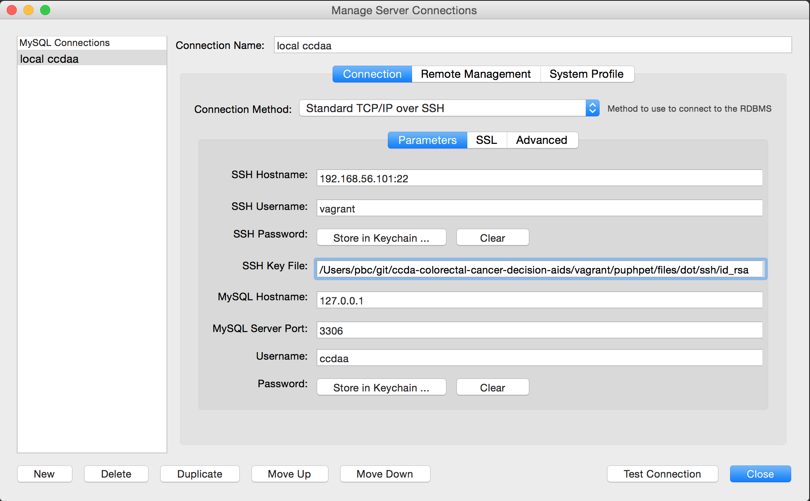

## Overview and Changes ##

The main ccdaa app had a series of questions at the beginning and the end of the app. I did not remove the forms, instead I changed the order of how the forms in the table using the admin user in MySQL.
The pictures in the pic_with_changes folder show the original order of the forms.

# Colorectal Cancer Decision Aids

This is an web-based decision making tool to educate and advise patients planning for a colorectal cancer screen.  This application helps the patient decide which screening method best suits them.  The tool includes a survey component to assess patient opinions on colorectal cancer screening and the educational materials.  The end products of this process are three fold: patient education, a clinical decision, and anonymous research data.

## Installation

CCDAA can be installed according to the manual instructions in [How to Install CCDAA](docs/README-install.md).  It can also be deployed via scripts to local VMs or an Amazon Webservices EC2 Instance.

## Requirements

CCDAA Requires a Linux host running, Apache, PHP, Python 2.7.  It also requires a MySQL Database either locally or on a shared host.

## Deploying to Amazon Web Services

You can deploy a fully running instance of this application to Amazon Web Services using the same VM deployment tools that build the local Demonstration and Development Environments.  See [Deploying to Amazon Web Services](docs/README-aws.md) for more information on deploying to AWS.

## Demonstration and Development Environments

A demonstration and development is included this project using a VM built with Vagrant and Virtual Box.

### Requirements

* Install Virtual Box
* Install Vagrant 1.6 or higher

    $ brew cask upgrade vagrant
    $ vagrant --version
    >> Vagrant 2.1.1
    
    $ vagrant plugin install vagrant-triggers
    
    $ vagrant plugin list
    >> vagrant-triggers (0.5.3)
    >> vagrant-vbguest (0.15.1)
    
* Edit your local `/etc/hosts` file 

    $ sudo vim /etc/hosts
    
 to include the line below:

    192.168.56.101  vagrant1
    

### Starting the Demonstration and Development Environments

Start the VM with the development and demo environments:

    $ cd vagrant
    $ cp puphpet/config-custom-local.yaml puphpet/config-custom.yaml
    $ vagrant up

The VM takes about 5 minutes to start.

As of this writing there is an error during the vagrant up step that interrupts the prevents some of the shell provisioning steps.  If you see an error in red "Error: Cannot create /var/www/html/adminer; parent directory /var/www/html does not exist" follow the "vagrant up", with these commands to make the missing directory and re-provision the VM:

    vagrant ssh -c 'sudo mkdir -p  /var/www/html/adminer' && vagrant provision

### Accessing the Demonstration Environment

To access the demonstration environment, open your web browser and access https://vagrant1/demo/.  You will be warned about a self-signed certificate and should click through the warning.

The URL presents the contents of the ./demo in the Git repo.  This is a JSON-driven copy of the  application being developed in ./web.

### Accessing the Development Environment

To access the development environment, open your web browser and access https://vagrant1/web/. As with the demo app, you will be warned about a self-signed certificate and should click through the warning.

This URL presents the contents of the ./web directory.

The development instance is preloaded with 50 pass IDs.

Enter one of these when promoted to authenticate. For instructions on resetting the list of preloaded IDs, see the [Developer's Notes](./docs/README-developer.md) in

### Accessing the PHP Adminer interface

To access the MySQL Adminer interface, open your web browser and access https://vagrant1/adminer Use these parameters:

    Username: root (or ccdaa)
    password: 123
    database: ccdaa

### Using MySQL Workbench

To use MySQL Workbench with the VM, the simplest path is probably tunneling through SSH. This example shows the configuration parameters. Most importantly, note that the SSH private key file is stored at ./vagrant/puphpet/files/dot/ssh/id_rsa in a Puphpet VM.

## Installation

To install the CCDAA Application and API use Vagrant to deploy a VM to the hosting environment of your choice.  The resulting VM can be manually configured (if needed), and saved as an image for use in that environment.

For those electing to do manual installation, see [README-install.md](docs/README-install.md)

## Configuration

This application is configured via the files

    api/v1/config.php
    web/app/config.js

See the example configuration files as a starting point for configuration:

    api/v1/config.php.example
    web/app/config.js.example

The puphpet scripts that rewrite these files for the development environment are also helpful to understand what needs to be rewritten  when deploying the application.  See these scripts:

    ./vagrant/puphpet/files/exec-always/edit-config-js.sh
    ./vagrant/puphpet/files/exec-always/edit-config-php.sh

## Extracting Data

To extrcat the survey response data, use the MySQL stored procedure, getResponsesForAll.  A mysql client can run the stored procedure like this:

    CALL getResponsesForAll()

This will return a tab-delimited data file with the fields subject_id, section, question, answer_title, answer_value, free_text, and created_at.  These conform to an entity-attribute-value model like this:

* entity: subject_id
* attribute: section, question, answer_title
* value: answer_value, free_text
* timestamp: created_at

## Contributing

This project will be released as an open source application on GitHub in the summer of 2015.  Contributors are encouraged to fork the repo, make commits and submit pull requests.  Please submit issues using the Github issue system.

## Maintainers

Primary maintenance of the Decision Aids Application is managed by CTS-IT at the University of Florida.  Key developers are: Roy Keyes <keyes@ufl.edu>, Alex Loiacono <atloiaco@ufl.edu>, and Philip Chase <pbc@ufl.edu>.

