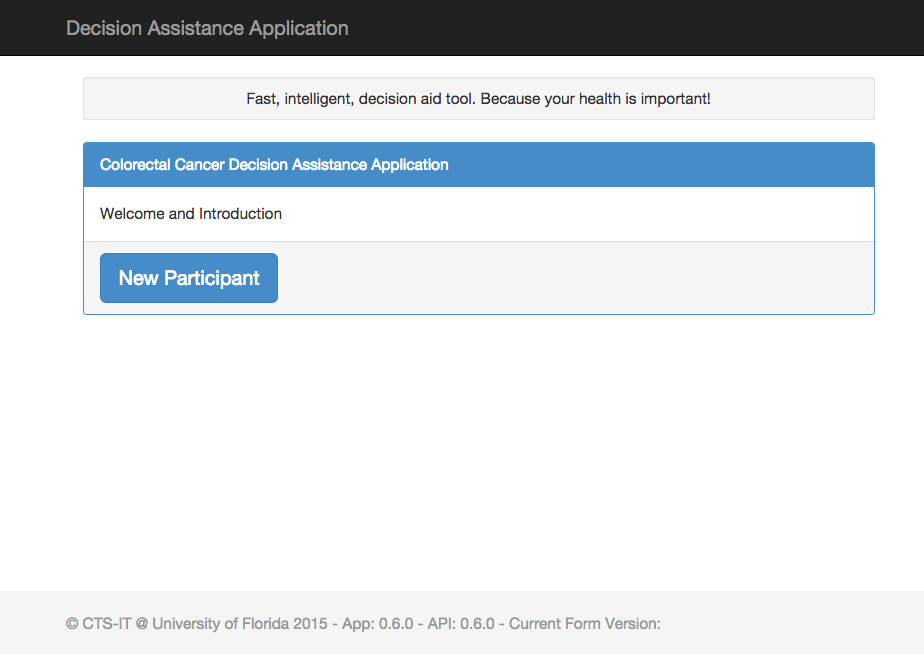

# How to Install CCDAA

## Intro

To install the CCDAA you can use the Vagrant-based tools to deploy to a local VM or Amazon Web Services.  Alternatively you can follow this procedure for manual deployment.

## Requirements

To use this application you will need to meet these prerequisites:

* OS - CCDAA does not require any specific OS. CCDAA's web service was developed using Debian Linux 7.5. It should work under any Linux distributions or any OS that supports CCDAA's other requirements. Script examples provided here are specific to Debian Linux distributions and only tested under Debian 7.5.
* Web server - Development and testing for CCDAA were done against Apache 2.4.x The provided re-write rules have not been ported to NGINX rules or IIS rules.
* PHP - The Web Service is written in PHP and was tested under PHP 5.6
* Python - The Web Service calls the python tool, MDAT.  MDAT requires Python 2.7
* Database - The Web Service reads survey form data and authorizatipon data from MySQL.  The Web Service writes the full response history to the MySQL database.  Neither of those data types contains blob data.  Blob data is never written to the MySQL database.  At initial deployment the database is 25MB.  It should not be expected to reach 512MB in normal usage. The MySQL 5.6 client and server were used in development and testing.
* Disk storage - Disk storage need for the application are minimal.  A deployed instance requires 2.8GB of disk space for the web client and server components.  In normal system usage this allocation should never be expected to exceed 4GB.
* Network (security) - The application requires inbound port 443 access from the network where it will be used to run. Inbound port 80 is also advised to allow redirect of insecure requests to https on port 443.  Outbound access to the public internet simplifies application installation.
* Memory - The application was tested and developed on systems with RAM ranging from 1GB to 1.7GB.

Notes:

* Disk I/O - Though the application does not require high I/O, the first-time generation of the form structure in JSON is slow on disks with low IOPS. This is a one time delay that occurs the very first time the form is generated in each language.

## Installation Steps

To install CCDAA, follow the steps outlined here.

### Unpack software

Extract the CCDAA and media archives to the document root for this host.

    mkdir -p /tmp/ccdaa
    cd /tmp/ccdaa
    unzip CCDAA.zip
    unzip ccdaa_media.zip

### Configure web server

* Set the document root to point at `/var/www/ccdaa`.  e.g. this line needs to appear in the Apache configuration:

    DocumentRoot "/var/www/ccdaa"

* *Redirect HTTP traffic to HTTPS* - All insecure web traffic should be
  redirected to HTTPS. This requires a directive something like this in the
  default virtual host:

        RewriteEngine On
        RewriteCond %{HTTPS} !=on
        RewriteRule ^/?(.*) https://%{SERVER_NAME}/$1 [R,L]

    or:

          Redirect "/" "https://example.com/"

* `./api/v1` needs the php engine and mod rewrite.  This requires a stanza of apache directives something like this:

        <Directory "/var/www/ccdaa/api/v1">
          Options Indexes FollowSymlinks MultiViews
          AllowOverride All
          Order allow,deny
          Allow from all

          SetEnvIf Authorization "(.*)" KEY=$1
          RewriteEngine On
          RewriteCond %{REQUEST_FILENAME} !-d
          RewriteCond %{REQUEST_FILENAME} !-f
          RewriteRule ^ index.php [L]
          RewriteBase /api/v1/

          # Might need this if you are using a FastCGI proxy
          # <FilesMatch "\.php$">
          #   Require all granted
          #   SetHandler proxy:fcgi://127.0.0.1:9000
          # </FilesMatch>
        </Directory>

* Web traffic to the root of the web space should be redirected to /web to simplify access via poorly qualified URLs.  This requires a rewrite rule in the port 443 virtual host configuration:

        RewriteEngine On
        RewriteRule ^/?$ /web/ [R,L]

### Copy ./api and ./web to document root

    sudo mkdir -p /var/www/ccdaa
    sudo cp -r /tmp/ccdaa/CCDAA/api /var/www/ccdaa
    sudo cp -r /tmp/ccdaa/CCDAA/web /var/www/ccdaa

### Copy videos to web root

    sudo mkdir -p /var/www/ccdaa/videos
    sudo cp -r /tmp/ccdaa/ccdaa_media/* /var/www/ccdaa/videos/

### Make the log dir and responses dir

    sudo mkdir -p /var/www/ccdaa/api/v1/logs
    sudo mkdir -p /var/www/ccdaa/api/v1/responses

### Adjust ownership and permissions of files in document root

    sudo chown -R www-data.www-data /var/www/ccdaa
    sudo find /var/www/ccdaa -type d | sudo xargs -i chmod 555 {}
    sudo find /var/www/ccdaa -type f | sudo xargs -i chmod 644 {}
    sudo find /var/www/ccdaa/api/v1 -type d | sudo xargs -i chmod 775 {}
    sudo find /var/www/ccdaa/api/v1/logs -type d | sudo xargs -i chmod 775 {}
    sudo find /var/www/ccdaa/api/v1/responses -type d | sudo xargs -i chmod 775 {}

### Install mdat

    sudo apt-get install python-pip
    sudo pip install mdat

### Configure web app with backend URL

Copy the file `./web/app/config.js.example` to `./web/app/config.js`

    sudo cp /var/www/ccdaa/web/app/config.js.example /var/www/ccdaa/web/app/config.js

Edit these lines in `/var/www/ccdaa/web/app/config.js` to reflect your local needs.  `api_url` must point the web service.  `api_key` must be changed to a unique value for this instance.  The same value must be inserted into the `ccdaa_login_auth` record of the `authorization` table of the database.

    "api_url": "https://example.com/api/v1/",
    "api_key": "This is a long string unique to this deployment of the CCDAA.",

### Configure database in ./api/v1/

The web service must be configured through the file `./api/v1/config.php.`  Copy the example file `./api/v1/config.php.example` and customize as needed:

    sudo cp /var/www/ccdaa/api/v1/config.php.example /var/www/ccdaa/api/v1/config.php

At a minimum the web service configuration for the database must be revised to point at the correct MySQL databse for this instance of ccdaa.

    'database' => array(
      'type' => 'mysql',
      'name' => 'ccdaa',
      'username' => 'ccdaa',
      'password' => '123',
      'host' => 'localhost',
      'timezone' => 'EST5EDT', //http://php.net/manual/en/timezones.php

### Load initial database

With a database created to match the databaze configuration above, the tables must be generated and populated to with the survey and authorization data.

First, create the *ccdaa* MySQL super-user and database:

    mysql -uroot -p -e "CREATE DATABASE ccdaa;"
    export CCDAA_PASSWORD='The database password I used in the web service configuration.'
    mysql -uroot -p -e "CREATE USER 'ccdaa'@'localhost' IDENTIFIED BY '$CCDAA_PASSWORD';"
    mysql -uroot -p -e "GRANT SUPER PRIVILEGES ON *.* TO 'ccdaa'@'localhost';"
    mysql -uroot -p -e "GRANT ALL PRIVILEGES ON ccdaa.* TO 'ccdaa'@'localhost';"
    mysql -uroot -p -e "FLUSH PRIVILEGES;"

Save the mysql credentials to ~/.my.cnf to simplify mysql maintenance.  Here's sample content for that file:

    [mysql]
    password="123"
    user=ccdaa
    database=ccdaa

Then, create the tables and load the survey data by running these commands on the host:

    cat /tmp/ccdaa/CCDAA/sql/ccdaa_all.sql | mysql

### Generate the site keys

The authorization data for the application will need to be updated to match the deployment details and provide a sufficient number of subject IDs for this study.

Revise the root authorization record setting the _token_ field to the same value used for api_key above.

    cat <<END | mysql
    update authorization
      set token= 'This is a long string unique to this deployment of the MDAT App.'
      where name like 'ccdaa_login_auth';
    END

Generate a new set of authorization records for this survey.  The command below would create 5000 authorization records ranging from 10000 - 14999.

    echo "CALL setupNewInstance('5000', '10000');" | mysql

Now reset the passkey used in each of the authorization records:

    cat <<END | mysql
    update authorization
      set passkey='Passkeys have 32 or fewer chars'
      where name like 'ccdaa_session_token';
    END

### Test application

Access the application at the hostname where it is deployed.  You should be redirected to the https://example.com/web/ and you should see an application welcome screen that looks something like this:

## Securing Access

This application is secured via a passkey set on the authorization records.  This passkey is shared across all of the authorized patient records.  It should be shared only with study staff and clinic staff assisting with the study.

The application itself is very open as survey applications often need to be.  Please add security at the network layer or via the web server as needed.  Devices accessing the application will need access to ports 80 and 443 of the host.  The application work will with any Apache authentication module such as basic authentication, LDAP, and Shibboleth.  The application has no features the depend on or consume the authentication data.

## Data Backups

CCDAA is dependent on normal MySQL database backup procedures to preserve form response data and authorization history.  In addition, log data is written to ./api/v1/logs/ and ./api/v1/responses/ and should be preserved to provide a full history of application activity.

Database and file system backups are not in the scope of this document.
